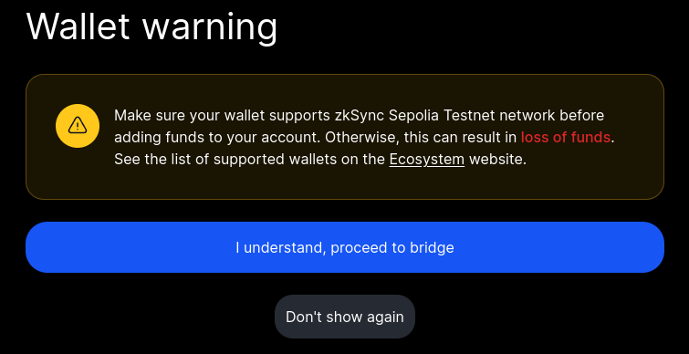
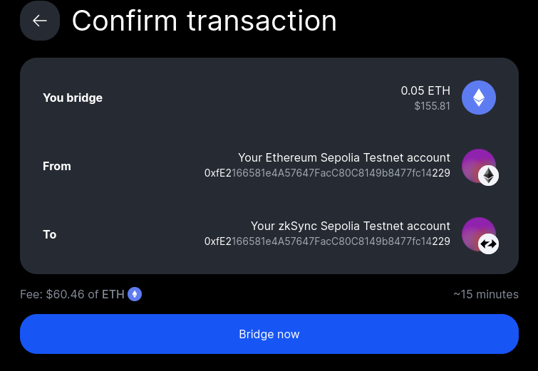
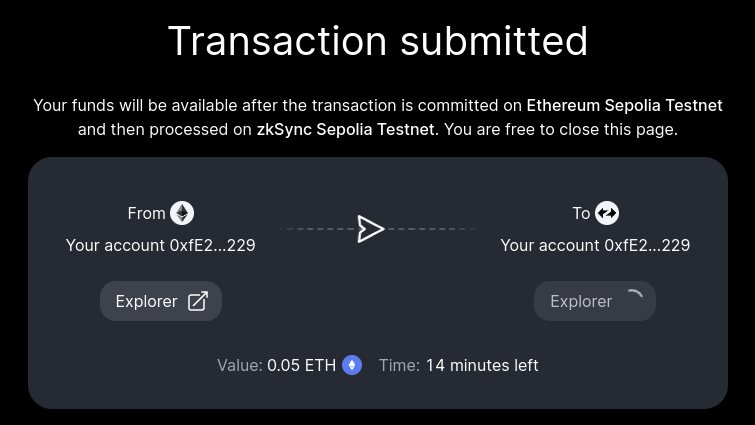

# Bridging

We're going to start by bridging. For the sake of this demo, we'll work [here](https://portal.zksync.io/bridge/)

Connect your wallet. fpr me that is MetaMask, then in the top left menu (if not currently visible) we need to change it to the [zkSync Sepolia TestNet](https://portal.zksync.io/bridge/?network=sepolia)

For my purposes, I transfered 0.05eth 

There was a wallet warning: 



details:



Need to wait: 



My transaction is in [EtherScan](https://sepolia.etherscan.io/tx/0xbeaa003a68652a1d0355d2c2b4581366477e0d70b16e30ebab54010fdc09abc9)

___

At this point I needed to add the zkSync Seoplia testnet to my wallet, I did this using the [chainlist webpage](https://chainlist.org/?search=zksync+sepolia&testnets=true)

Adding the network to my wallet included a few warnings as was a testnet, but once connected I could see my funds in the metamask wallet as expected. 

___

At this point in time, there is an issue with Remix/zkSync where the contracts need to be in a contracts folder in order for the zkSync plugin in Remix to be able to see them. So I have also made a folder and moved my contracts into this folder in readiness for testing. 

___

After connecting to my wallet and Deploying, I receieved this output:

```bash

Deploying contract SimpleStorage
{
  "type": 113,
  "nonce": 0,
  "maxPriorityFeePerGas": {
    "type": "BigNumber",
    "hex": "0x017d7840"
  },
  "maxFeePerGas": {
    "type": "BigNumber",
    "hex": "0x017d7840"
  },
  "gasLimit": {
    "type": "BigNumber",
    "hex": "0xaac588"
  },
  "to": "0x0000000000000000000000000000000000008006",
  "value": {
    "type": "BigNumber",
    "hex": "0x00"
  },
  "data": "0x9c4d535b0000000000000000000000000000000000000000000000000000000000000000010000a102ea87...",
  "chainId": {
    "type": "BigNumber",
    "hex": "0x012c"
  },
  "from": "0xfE2166581e4A57647FacC80C8149b8477fc14229",
  "customData": {
    "gasPerPubdata": {
      "type": "BigNumber",
      "hex": "0xc350"
    },
    "factoryDeps": "[ <...> ]",
    "customSignature": "0xd4798ce7dd25d6fc42d80f874dd2be2abc3ada8c7323ac1e672526bd632769a22aa5594113193f76966363a9290a1af9c35e2722224c6a5fcbdc619574ca3cae1c"
  },
  "hash": "0x4d9d9a8f933ed65203cccef06d8659bbd9f3e7d757e7e553b6ae4050f1b65c40",
  "confirmations": 0
}
Verification successful.
```

My Contract Address = 0xa8681F4E8ad8288dFA4abe8Da2125Cb9ecF04354

I can take this to the [zkSync Sepolia Explorer](https://sepolia.explorer.zksync.io/) which is like an EtherScan for zkSync.

[My Contract](https://sepolia.explorer.zksync.io/address/0xa8681F4E8ad8288dFA4abe8Da2125Cb9ecF04354)

An [X](https://x.com/oneMore_David/status/1811334124650541275) re that smart contract deployment